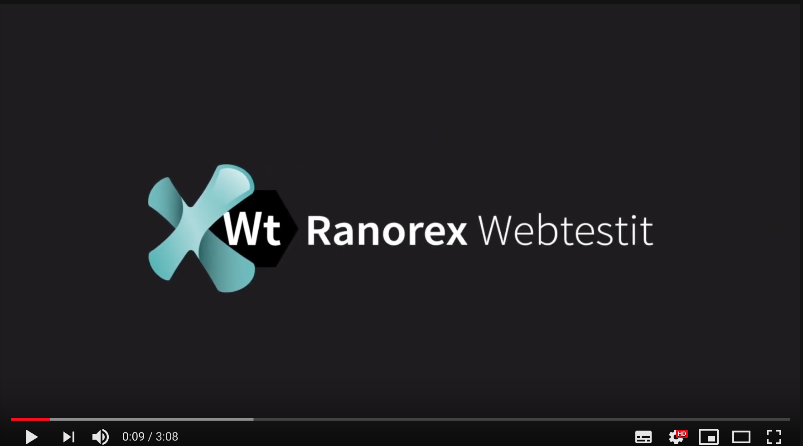

# Ranorex VUnit Report Viewer - Free Chrome Extension

Description:
Automatically render XML reports in your browser simly by drag-and-drop action. With our J-unit reporter, you are getting a super-nice rendered test report in your browser. Those not so nice looking XML’s are transformed and rendered into fancy HTML reports that you can easily view in the browser. All you need to do is to load the report file and be amazed

 &nbsp; &nbsp; &nbsp; &nbsp; &nbsp; 
 

## What's in this repo?

Use this repository to drop your feedback, feature requests, or issues you may have found when using our Chrome browser extension. We'd love to know what you think of it!

## How do I get this cool Chrome Extension?

You can install the extension from the [Google Chrome Web Store](https://chrome.google.com/webstore/) or from the [Mozilla Firefox Add-ons](https://addons.mozilla.org/en-US/firefox/).

## Where can I get more information?

Visit [Our official Diccourse](https://discourse.webtestit.com/t/rx-vunit-report-viewer/1386) or our [Medium](https://medium.com/ranorex-webtestit) space to learn about the features and benefits of Ranorex VUnit Report Viewer, and review our updates in the [Changelog](CHANGELOG.md).
