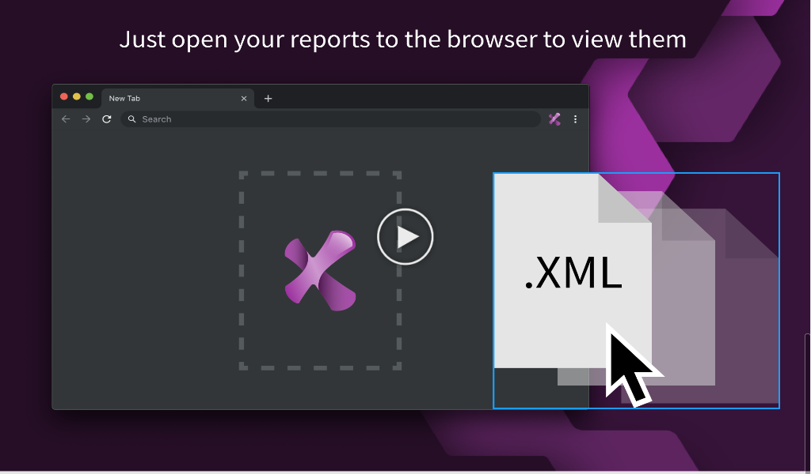

# Ranorex Vunit - turn plain JUnit XML's into visually pleasing reports

Ranorex Vunit is a free extension that allows you to turn plain JUnit XML test reports into visually pleasing reports that provide all the necessary details about your test cases. With Ranorex Vunit extension installed, simply drag and drop your XML test reports generated in Ranorex Webtestit or any other testing IDE and view them directly in your browser.

 
 

## What's in this repo?

Use this repository to drop your feedback, feature requests, or issues you may have found when using our browser extension. We'd love to know what you think of it!

## How do I get this cool Chrome Extension?

You can download install this free extension from the [Google Chrome Web Store](https://chrome.google.com/webstore/).

## Where can I get more information?

Visit [Our official Diccourse](https://discourse.webtestit.com/t/rx-vunit-report-viewer/1386) or our [Medium](https://medium.com/ranorex-webtestit) space to learn about the features and benefits of Ranorex VUnit Report Viewer, and review our updates in the [Changelog](./changelog.md).
